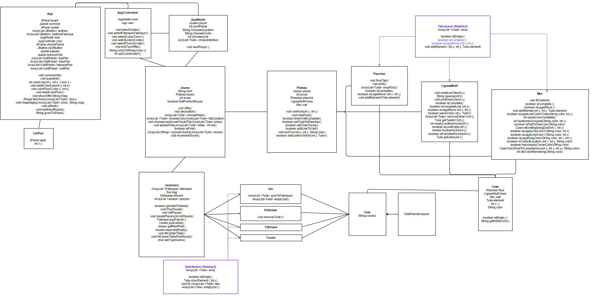

# Rapport de projet : Azul

## Etapes du developpement

### Création du diagramme des classes (cf Modèle des classes)

Pour rendre l'implémentation plus simple, nous avons séparé les parties communes(fabriques, centre) des parties personnelles (mur, lignes). La classe `Jeu` sert de lien entre ces deux groupes.

## Problèmes connus

## Nos pistes d'extensions

Les règles afin de jouer à la variante avec le mur incolore sont les suivantes:
1.  Une tuile de couleur ne peut pas être présent sur la même colonne / ligne / diagonale (montante vers la droite).
2.  Les 5 tuiles d'une couleur doivent être obligatoirement placés sur une diagonale (descendante vers la droite) et doivent les compléter.  
3.  On peut choisir la coordonnée X dans le mur lorsqu'on veut placer une couleur seulement dans les cas suivants:   
Au début, lorsque aucune tuile d'une couleur n'a été placé.  
Lorsqu'il reste qu'une seule tuile d'une couleur et qu'il faut compléter l'un des coins sans diagonales.
A la fin on devrait obtenir le schéma suivant:

## Modèle des classes :
