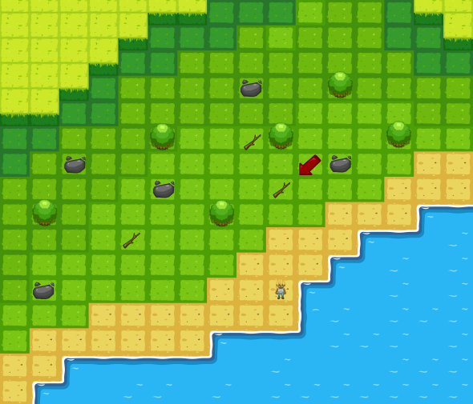
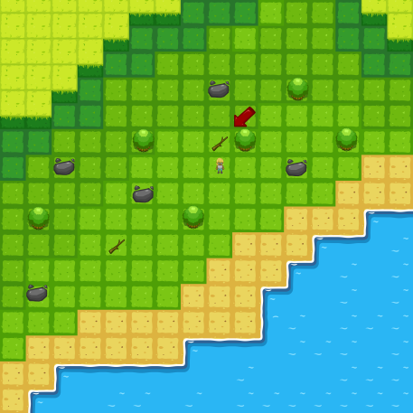
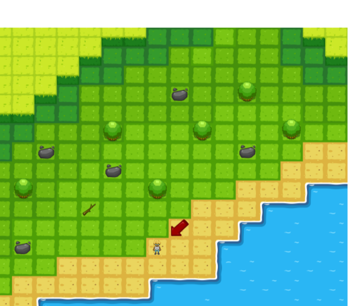
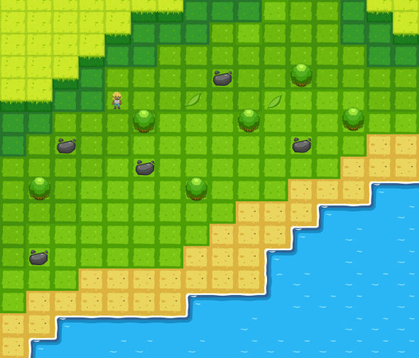
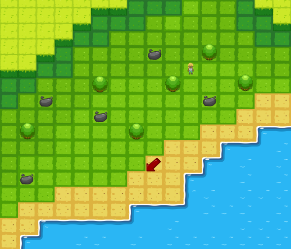
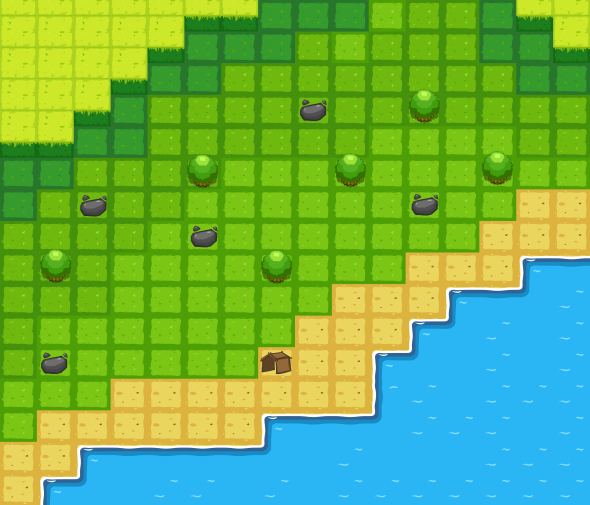
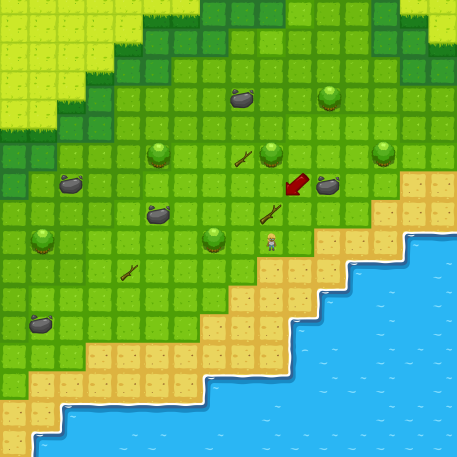

# Chapitres et quêtes

> Pas à jour !

## Stockage

Les chapitres sont stockés dans des fichiers `JSON` facilitant leur ajout et
modification.

### Exemple de fichier `JSON`

```
{
    "id" : "c1",
    "description" : "Chapitre 1 - La découverte.",

    "quests" : {
        "q1c1" : {
            "description" : "Il te faut du bois ! Déplace toi jusqu'à cette branche grâce à la fonction $avancer()$ et récupère là avec $ramasser_bois()$.",
            "goal" : "Récupérer une branche.",
            "function" : ["avancer()", "ramasser()"],
            "test" : { "wood" : 1 }
        },
        "q2c1" : {
            "description" : "Super ! Tu vois, il est arrivé dans ton inventaire. Ton inventaire te sera utile pour stocker tout ce que tu trouves. Ajoute une autre branche à ton inventaire. C'est deux nouvelles fonctions te permettent de tourner : ̀$tourner_a_gauche()$  & $tourner_a_droite()$.",
            "goal" : "Récupérer une branche en plus.",
            "function" : ["avancer()", "ramasser()"],
            "test" : { "wood" : 2 }
        },
        ...
    }
}
```

## Description des quêtes

### Chapitre 0

Vidéo - arrivée sur l'île deserte

### Chapitre 1 - la Découverte

#### Quete 1.1
-   _Il te faut du bois !_  Déplace toi jusqu'à cette branche en utilisant la fonction `avancer()` et `ramasser_bois()`

        Apres la vidéo du début, le personnage arrive sur une des cases de la carte. Il n'a a disposition que la fontion avancer() et doit l'utiliser autant de fois que nécessaire pour déplacer le personnage a l'arbre le plus proche.
        Il faut pointer l'arbre pour guider le personnage, et pas de virage.



#### Quete 1.2
-   _Super ! Tu vois, il est arrivé dans ton inventaire. Ton inventaire te sera utile pour stocker tout ce que tu trouves._ Ajoute une autre branche à ton inventaire. C'est deux nouvelles fonctions te permettent de tourner : ̀`tourner_a_gauche()`  & `tourner_a_droite()`.

        Il faut mettre d'autre branches sur la carte, l'endroit n'est pas important puisqu'on va dire plus tard au joueur de retourner à son point de départ.




#### Quete 1.3
-   _Tu ne peux pas avoir tout ce que tu veux dans ton inventaire, récupère les objets avec parcimonie..._ Retourne ici (indiquer le point de départ).

        Le joueur fait ce qu'il a à faire pour ramener, il faut juste vérifier que le point d'arrivée est le même que le point de départ.




#### Quete 1.4
-   _Pendant ta survie, tu vas avoir faim. Mais il y a de quoi manger sur cette île !_ Va chercher ce fruit en utilsant `ramasser_fruit()`! (indiquer un fruit)

        L'objectif est juste de faire découvrir la fonction ramasser_fruit().

        Faire dormir le personnage. peut etre ajouter une feuille dans la verticale ou l'horizontale du point de départ, ainsi que  car le joueur utilisera une boucle au prochain tour et ne pourra aller que dans une direction.


> Le Chapitre 1 - la Découverte est terminé, suis les instructions données et tu survivras dans ce monde hostile.


### Chapitre 2 - la Cabane

Pour d'effectuer une action, tu dois être sur qu'elle est possible. Pour ça, il faut utiliser un test  if(_condition_)then _action_ else _autre contidion_̀.Ton personnage n'est pas très intelligent. Si tu lui ordonne de faire une action, comme ramasser_fruit() alors qu'il n'y a pas de fruit, il ne comprendra pas. Tu dois donc t'assurer que tout action que tu appelles est réalisable.


#### Quete 2.1

-    _Un fruit, super ! Mange le !_Tu peux utiliser la fonction `manger_fruit()̀` Mais attention ! Les fruits ne se conservent pas indéfiniment. Pour manger un fruit, tu dois être sur qu'il n'est pas pourri. Utilise pour cela, utilie la condition `fruit_est_pourri()` et l'action `jeter_fruit()` s'il est pourri. Un fruit se conserve ***n*** tours dans ton sac, fait attention. De plus, pour ***m*** action réalisées, ta faim diminue. Veille à ce qu'elle ne soit jamais à 0.


         Découverte de if


Pour effectuer une suite d'action qui se répète en boucle, il existe une boucle : la boucle while(condition) do: action. La négation d'une condition s'exprime par un point d'exclamation ("!") devant celle-ci.


#### Quete 2.2

-    _Tu as très mal dormi cette nuit. Tu ne peux plus retenir autant d'instruction que tu veux._. Tu dois construire une  cabane. Pour cela, il te faut 2 morceaux de bois et 2 feuilles. Regarde dans la bonne direction et va chercher un morceau de bois. Tu dois utilser une boucle `while()` avec la condition `chemin_est_libre()`, ainsi que la fonction `ramasser_branche()`.


        Ajouter la possibilité de voir la doc de la boucle while.

        Il faut autoriser 6 instruction et deux boucles :
            1. Se tourner à droite ou à gauche.
            2. boucle While
            3.     avancer()
            4. ramasser_branche()
            5.
                Et faire la même chose une deuxieme fois dans le programme pour rammasser la deuxieme feuille. Il faut donc bien placer les feuille au début du chapitre


#### Quete 2.3
- *Maintenant que tu as des branches, il te faut des feuilles !*





#### Quete 2.4
-   _Super ! Tu dois maintenant revenir là où tu as dormi pour y placer la cabane._ Tu ne peux pas faire ça avec la boucle `while()`. Tu peux utiliser une boucle `repeat  (n) times (action)` *nom à revoir peut-être* .

        C'est la boucle for, le joueur doit choisir le nombre de fois qu'il fait l'action. Normalement , il n'aura a fait qu'a avancer n fois, tourner, et avancer m fois. Il faut donc 5 blocs: 2 repeat , 2 avancer, 1 tourner.

        Quand le joueur arrive, la cabane est construite automatiquement.




-    _On s'en sort bien, enfin un abris._

         Dormir



## Chapitre 3

**On mettra ici les vrais "défis" autres que la découverte pour que le joueur utilise tout ce qu'il sait sans être guidé. A faire à la fin si on a le temps.**


# Exemple de déroulement

Programme : Quête 1.1

        avancer()
        avancer()
        avancer()
        ramasser_bois()

Déroulement sur la carte :





