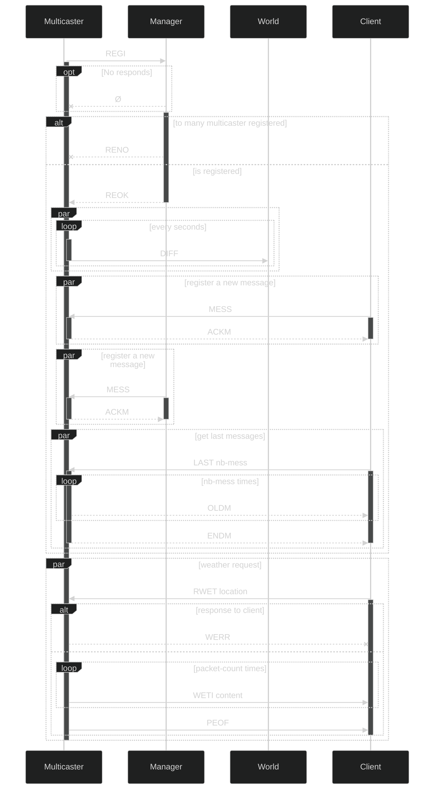
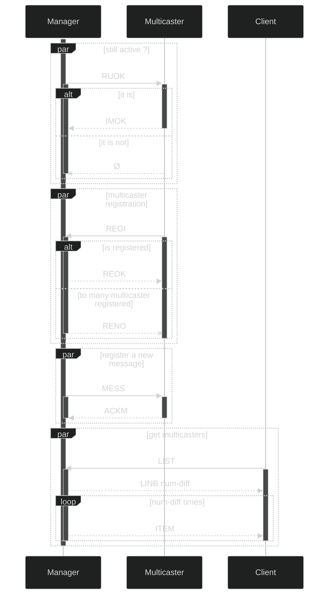
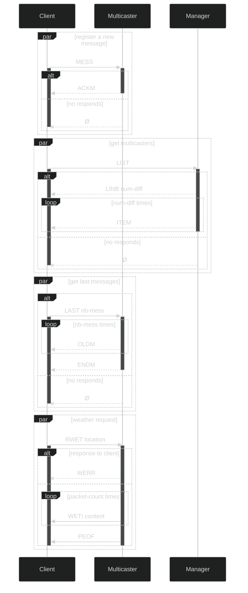

# Sequence diagrams

[[_TOC_]]

## Multicaster sequence diagram

```mermaid
%%{init: {'theme': 'dark', 'darkMode': true} }%%
sequenceDiagram

	activate Multicaster
	Multicaster->>Manager: REGI
	activate Multicaster
	opt No responds
		Manager--xMulticaster: Ø
	end
	activate Manager
	alt to many multicaster registered
		Manager--xMulticaster: RENO
	else is registered
		Manager-->>Multicaster: REOK
		deactivate Manager
		par
			loop every seconds
				activate Multicaster
				Multicaster->>World: DIFF
				deactivate Multicaster
			end
		end
		par register a new message
			Client->>+Multicaster: MESS
			activate Client
			Multicaster-->>-Client: ACKM
			deactivate Client
		end
		par register a new message
			Manager->>+Multicaster: MESS
			activate Manager
			Multicaster-->>-Manager: ACKM
			deactivate Manager
		end
		par get last messages
			Client->>+Multicaster: LAST nb-mess
			activate Client
			loop nb-mess times
				Multicaster-->>Client: OLDM
			end
			Multicaster-->>-Client: ENDM
			deactivate Client
		end
	end

    par weather request
        Client ->>Multicaster: RWET location
        activate Client
        alt response to client
            Multicaster--xClient : WERR
        else
            loop packet-count times
                Multicaster->>Client: WETI content
            end
            Multicaster->>Client : PEOF
        end
        deactivate Client
	end
	deactivate Multicaster
```

## Manager sequence diagram

```mermaid
%%{init: {'theme': 'dark', 'darkMode': true} }%%
sequenceDiagram

	activate Manager
	par still active ?
		Manager ->>+ Multicaster: RUOK
		activate Manager
		alt it is
			Multicaster-->>-Manager: IMOK
		else it is not
			Multicaster--xManager: Ø
			deactivate Manager
		end
	end
	par multicaster registration
		Multicaster->>+Manager: REGI
		activate Multicaster
		alt is registered
			Manager-->>Multicaster: REOK
		else to many multicaster registered
			Manager--x-Multicaster: RENO
		end
		deactivate Multicaster
	end
	par register a new message
		Manager->>+Multicaster: MESS
		activate Manager
		Multicaster-->>-Manager: ACKM
		deactivate Manager
	end
	par get multicasters
		Client ->> Manager: LIST
		activate Manager
		activate Client
		Manager -->> Client: LINB num-diff
		loop num-diff times
			Manager -->> Client: ITEM
		end
		deactivate Client
		deactivate Manager
	end
	deactivate Manager
```

## Client sequence diagram

```mermaid
%%{init: {'theme': 'dark', 'darkMode': true} }%%
sequenceDiagram

	activate Client
	par register a new message
		Client ->>+ Multicaster: MESS
		activate Client
		alt
			Multicaster-->>-Client: ACKM
		else no responds
			Multicaster--xClient: Ø
			deactivate Client
		end
	end
	par get multicasters
		Client ->> Manager: LIST
		activate Manager
		activate Client
		alt
			Manager -->> Client: LINB num-diff
			loop num-diff times
				Manager -->> Client: ITEM
			end
		deactivate Manager
		else no responds
			Manager--xClient: Ø
			deactivate Client
		end
	end
	par get last messages
		alt
			Client->>+Multicaster: LAST nb-mess
			activate Client
			loop nb-mess times
				Multicaster-->>Client: OLDM
			end
			Multicaster-->>-Client: ENDM
		else no responds
			Multicaster--xClient: Ø
			deactivate Client
		end
    end
    par weather request

        Client ->>Multicaster: RWET location
        activate Multicaster
        activate Client
        alt response to client
            Multicaster--xClient : WERR
        else
            loop packet-count times
                Multicaster->>Client: WETI content
            end
            Multicaster->>Client : PEOF
        end
        deactivate Client
        deactivate Multicaster
	end
```
