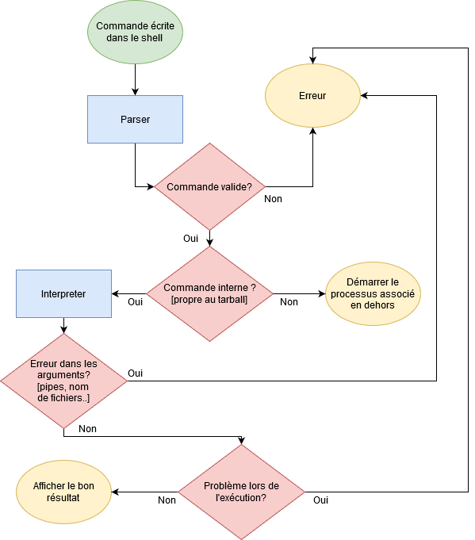

## Idée générale

L'objectif est d'implémenter un shell manipulant les *tarballs* comme des fichiers normaux (répertoires).

> Par exemple pouvoir effectuer la commande `cd tarball.tar`.

## Principales difficultés

La difficulté par rapport à un shell normal est la gestion du *posix_header*
associé à chaque *tarball*, on ne pourra donc pas utiliser les fonctions
standards du shell qui manipulent des fichiers.

Il faudra donc les implémenter en C : `mv`, `touch`, ...
Pour autant, on pourra se servir des commandes du shell pour les fonctions
n'agissant pas sur les fichiers : `ping`, ...

-> Comme on doit gérer les arguments des commandes et le `|`, il faut
implémenter un parser.


## Organisation du développement

### Première idée de fonctionnement (Hugo)

1. Implémenter un shell standard
    *   Parser pour séparer commandes et arguments : paramètres et fichiers associés
    *   Executeur qui exécute la commande normalement.

2. Implémenter un shell utilisable uniquement dans les *tarballs*
    *   Implémenter les commandes listées ci-dessous pour qu'elles soient utilisables dans un *tarball*

3. Le shell doit être utilisable à la fois à l'intérieur et à l'extérieur d'un *tarball*

### Première idée d'implémentation (Emile)

Ce que la boucle principale devrait faire :
```
1. PARSER la commande de l'utilisateur.
2. L'EVALUER pour déterminer si il faut effectuer une modification sur l'entrée ou si
c'est une commande n'impliquant pas de tarballs :
    2.1. Si non : DELEGUER l'exécution de la commande aux fonctions execs().
	2.2. Si oui :
		(2.2.1. TRAITER l'entrée.)
		2.2.2. APPELER la commande avec la fonction implémentée associée.
(3. AFFICHER le résultats.)
```

### Première idée d'implémentation (Antoine)



## Commandes à implémenter

**Liste non exaustive des commandes à implémenter**

### Commandes dans le sujet

    cd
    exit
    pwd
    mkdir
    rmdir
    mv
    cp
    rm (-r)
    ls (-l)
    cat
    >, >>, <, <<, ;, &&,

### Commandes qui ne sont pas dans le sujet

    touch
    echo
    grep
    wc
    help

## Ressources

*   [conventions d'écriture](https://users.ece.cmu.edu/~eno/coding/CCodingStandard.html)
*   [structure d'un projet en c](https://emmanuel-delahaye.developpez.com/tutoriels/c/bonnes-pratiques-codage-c/#LIV)
*   [implémenter un shell](https://brennan.io/2015/01/16/write-a-shell-in-c/)
*   [les tubes en c](https://aljensencprogramming.wordpress.com/2014/05/16/implementing-pipes-in-c/)
*   [structure d'un shell](https://www.cs.purdue.edu/homes/grr/SystemsProgrammingBook/Book/Chapter5-WritingYourOwnShell.pdf)
*   [entrées utilisateur](https://stackoverflow.com/questions/16248841/how-to-use-a-loop-function-with-user-input-in-c)
*   [couleurs](https://stackoverflow.com/questions/3585846/color-text-in-terminal-applications-in-unix)
